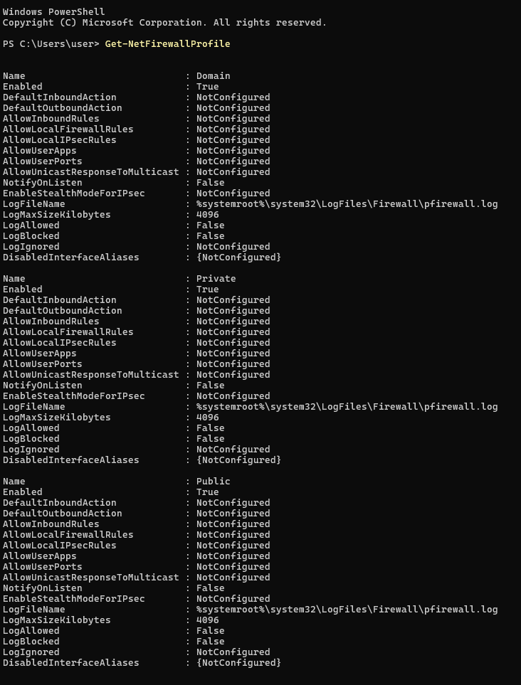
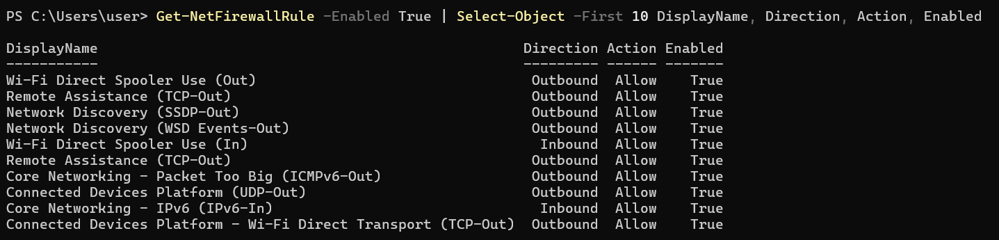
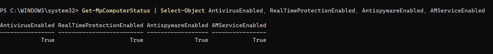
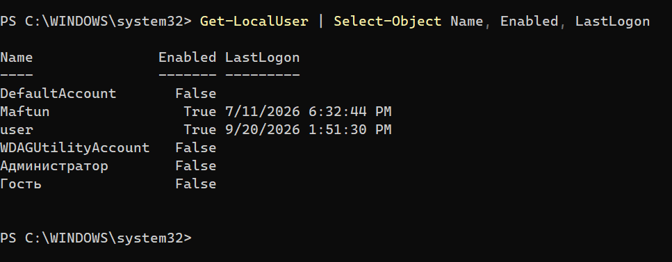
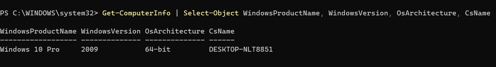
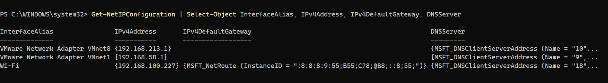

Windows Security Audit

A practical Windows security audit performed using PowerShell. The project covers firewall configuration, Windows Defender status, local user accounts, system information, and network configuration.

Objectives
Inspect Windows security configuration
Review firewall profiles and enabled rules
Check Windows Defender protection status
Review local user accounts
Collect system and network information
Practice PowerShell for Windows administration and security auditing
Environment
OS: Windows 11
Tool: PowerShell

1. Firewall Profiles
Get-NetFirewallProfile

Used to review the Domain, Private, and Public firewall profiles.

2. Firewall Rules
Get-NetFirewallRule -Enabled True |
Select-Object -First 10 DisplayName, Direction, Action, Enabled

Used to review a sample of enabled inbound and outbound firewall rules.

3. Windows Defender Status
Get-MpComputerStatus |
Select-Object AntivirusEnabled, RealTimeProtectionEnabled, AntispywareEnabled, AMServiceEnabled

Used to check the status of key Windows Defender protection components.

4. Local Users
Get-LocalUser |
Select-Object Name, Enabled, LastLogon

Used to review local user accounts and their status.

5. System Information
Get-ComputerInfo |
Select-Object WindowsProductName, WindowsVersion, OsArchitecture, CsName

Used to collect basic Windows system information.

6. Network Configuration
Get-NetIPConfiguration |
Select-Object InterfaceAlias, IPv4Address, IPv4DefaultGateway, DNSServer

Used to inspect network interfaces, IPv4 configuration, gateway, and DNS settings.

